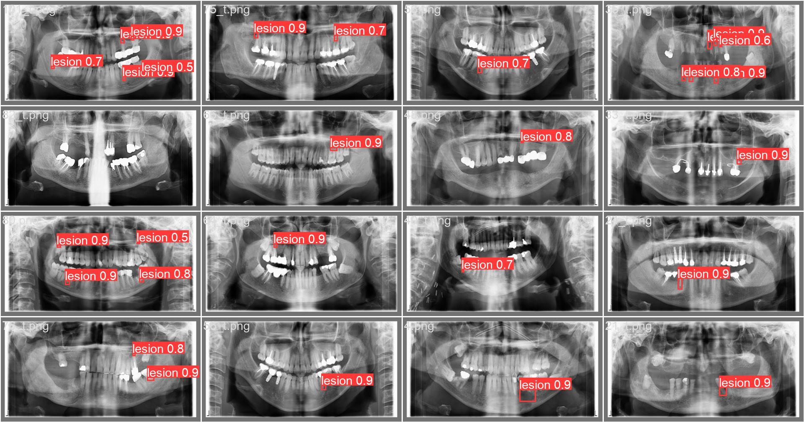

# Entraînement du modèle yolov5 sur les images radiographiques

## 1) Création d'un environnement et l'installation des packages nécessaires

Pour l'utilisation de ce modèle, il faut avoir une version de Python entre 3.7 et 3.10.

### a) Création et activation de l'environnement 

Sur une invite de commandes on exécute les commandes suivantes pour créer et activer l'environnement (Je l'ai nommé Projet3A)


```python
py -m pip install --upgrade pip
```


```python
py -m pip install --user virtualenv
```


```python
py -m venv Projet3A
```


```python
.\Projet3A\Scripts\activate
```


```python
cd Projet3A
```

### b) Importation du modèle Yolov5 initial et installation des packages nécessaires


```python
git clone https://github.com/ultralytics/yolov5
```


```python
cd yolov5
```


```python
git reset --hard 064365d8683fd002e9ad789c1e91fa3d021b44f0
```

Après qu'on a importé le modèle Yolov5, il faut installer les packages nécessaires par de suite, d'où sert le fichier requirements.txt dans le dossier yolov5. Or, on utilise d'autres packages en plus des packages du modèle initial et pour régler ceci j'ai modifié le fichier requirements.txt en y rajoutant les autres packages nécessaires

Donc il faut remplacer le fichier requirements.txt dans le fichier requirement que vous pouvez trouver sur le github avec le même nom (requirements.txt) et éxécuter la commande suivante


```python
pip install -r requirements.txt
```

### c) Structure des données

Vu qu'on utilise le modèle initial pour l'adapter à notre dataset, il faut inclure les fichiers de notre dataset dans le dossier yolov5.
Premièrement, il faut mettre le fichier lesions.yaml (un fichier indiquant au modèle les chemins d'accès des bases de données d'entraînement, validation et test) dans le dossier data.

Deuxièmement, il faut mettre le script lesions_data.py (fichier de conversion et répartition des données) dans le dossier yolov5 .

Après qu'on a organisé le dossier yolov5, on peut passer à la conversion et répartition des donnnées en premiers temps: Pour cela, il faut avoir les chemins d'accès des deux dossiers (dossier pour les fichiers xml et un autre pour les images DICOM)


```python
python lesions_data.py chemin/vers/fichier/xml  chemin/vers/images
```

Cette commande permet de:
1) Convertir les images DICOM en images png de dimensions (512,256) (modifiables en modifiant la fonction  convert_dicom_folder_to_png)

2) Convertir les fichiers xml en des fichier txt

3) Répartir la base de données en 80% train, 10% validation, 10% test (Pourcentages modifiables en modifiant les arguments de la fonction train_test_split)

### d) Entraînement

On lance l'entraînement en exécutant le fichier train.py avec les arguments suivant :

img: taille de l'image 

epochs: nombre d'epochs (itérations sur le dataset entier) 

data: chemin d'accés vers le fichier yaml du dataset

batch: taille du batch 

cfg: Configuration du modèle

weights: Pour montrer au modèle les poids donnés au paramétres au début (on peut lui passer finalbest.pt pour commencer l'entraînement depuis la configuration optimale trouvée)
    

La configuration optimale a été trouvée à l'aide de cette configuration (Entraînement du modèle yolov5s sur des images de (1200,1200) avec un batch de 32)


```python
python train.py --data lesions.yaml --epochs 600 --weights '' --img 1200 --cfg ./models/yolov5s.yaml
```

Après l'entraînement, le modèle crée un dossier train dans runs contenant les résultats d'entraînemnt, les paramètres du modèle optimal trouvé sous forme de fichiet pt (best.pt), et la prédiction du modèle sur les images de validation

La commande ci-dessus a permis de trouver la configuration optimale que j'ai mis sur le github sous le nom de finalbest.pt, on peut utiliser cette configuration pour:

1) Prédire la position des lésions sur des images radiographiques en utilisant le fichier val.py ou detect.py

2) Refaire un entraînement du modèle à partir de cette configuration (dans le cas d'ajout de nouvelles images ou qu'on veut changer de nombre d'epochs ou dimensions d'images

Pour la prédiction on utilise le fichier val.py qui utilise le modèle yolov5 avec la configuration en argument pour prédire sur les images de test ou de validation (on met le nom de la base de données en argument --task)


```python
python val.py --weights finalbest.pt  --task test --data lesions.yaml --img 1200
```

Pour la détection sur des nouvelles images on utilise le fichier detect.py 

```python
python detect.py --weights finalbest.pt --source chemin/vers/images --img 1200
```


Résultats finaux 



Pour plus de détails n'hésitez pas à me contacter par mail: achraflouzali@gmail.com
